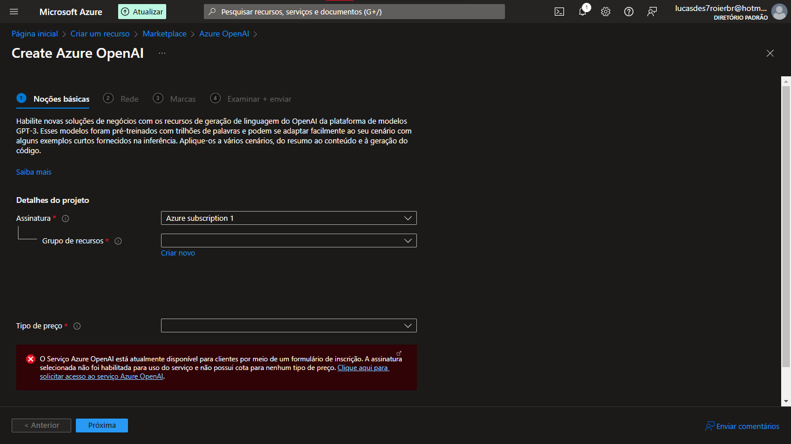
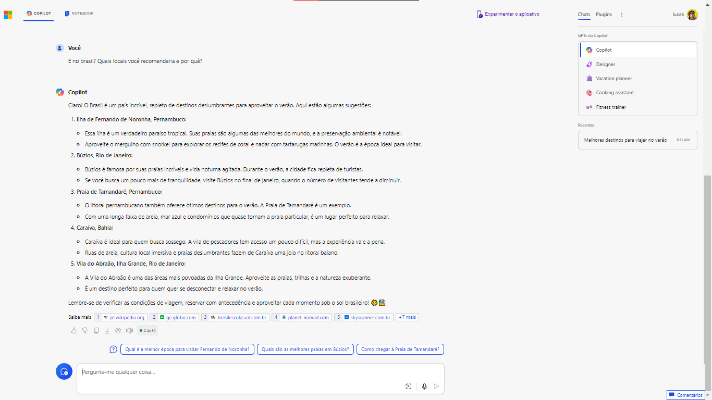
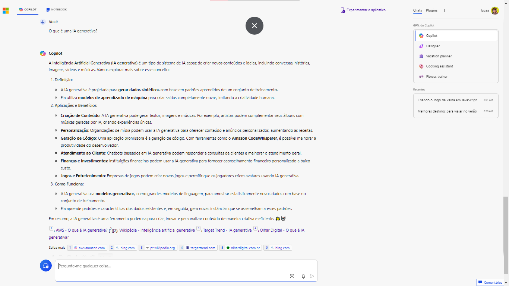
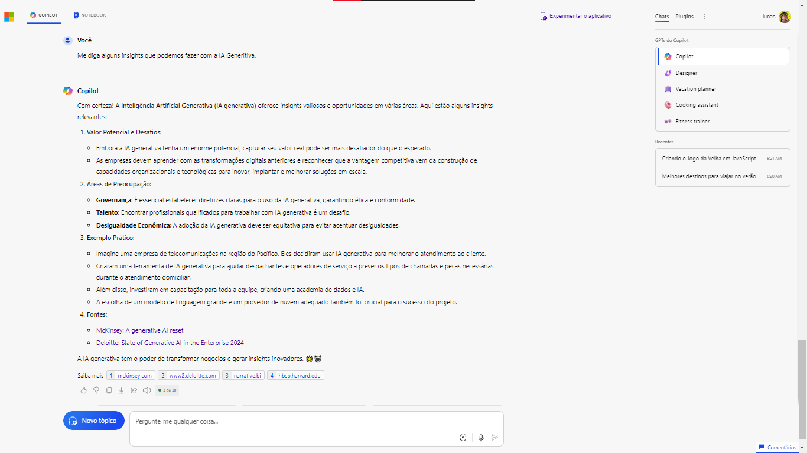
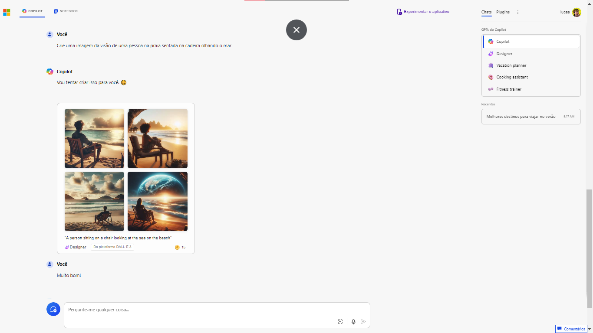
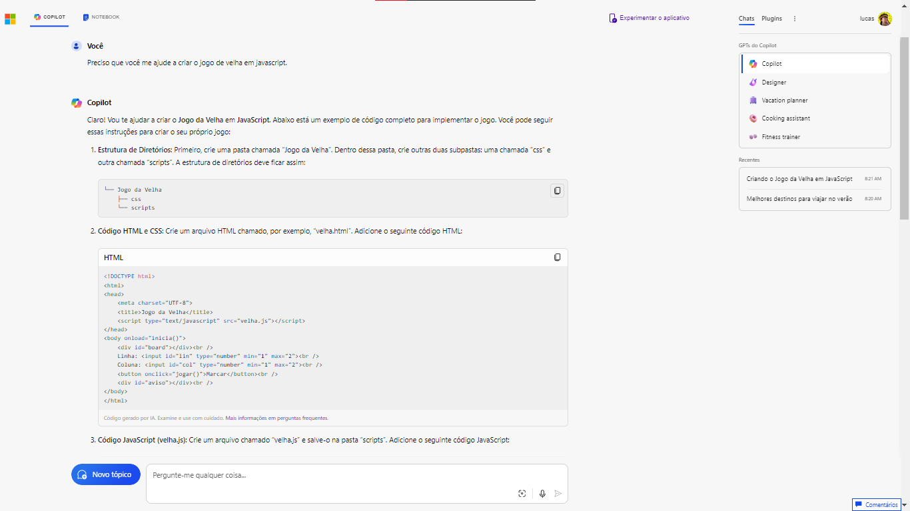

# IA Generativa com Copilot e OpenAI

Infelizmente, quando você tenta utilizar o recurso Azure OpenAI, é necessário preencher um formulário e solicitar autorização para a Azure OpenAI, que por sua vez não permite contas pessoais para estudo.

###

###

**Então, a abordagem desta vez será diferente! Vamos utilizar o serviço [Copilot](https://copilot.microsoft.com/) da Microsoft como laboratório 🚀**

#

O Copilot usa a interação conversacional e possue uma linguagem natural ao se comunicar com o cliente. Segue alguns exemplos de como podemos utilizar essa poderosa ferramenta ⚒️

# Realizar pesquisas:

###

###

# Realizar estudos:

###

###

# Gerar imagens:

###

> **Resultado:**

###

###

# Gerar códigos:

###

###

> **Resultado:**

###

###

#

### **Em resumo, o Copilot é uma ferramenta poderosa que pode acelerar o processo de desenvolvimento de software, mas os desenvolvedores devem usá-lo com cautela e responsabilidade, complementando-o com seu próprio conhecimento e experiência.**
